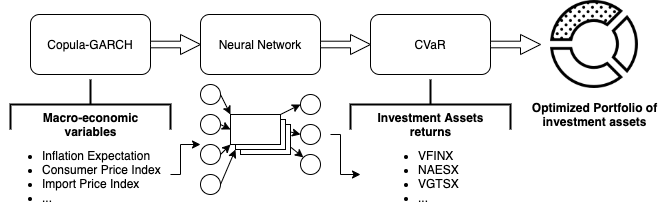
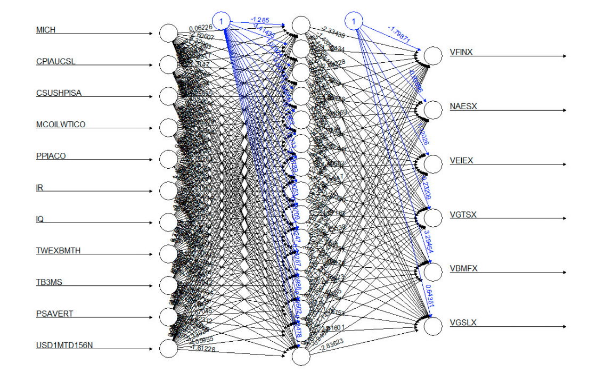
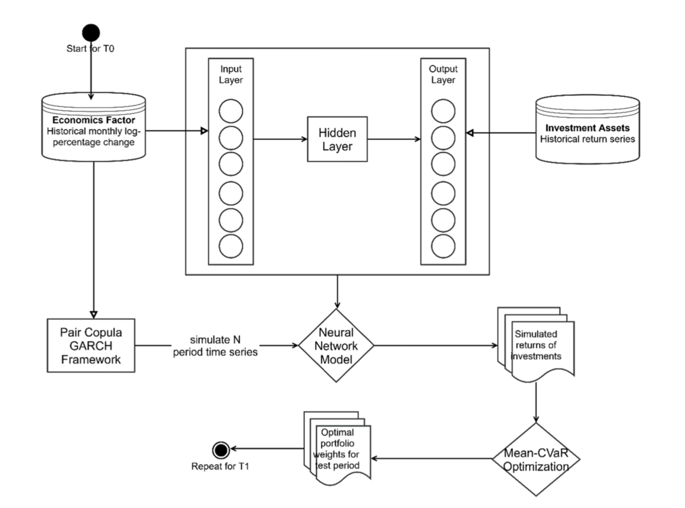
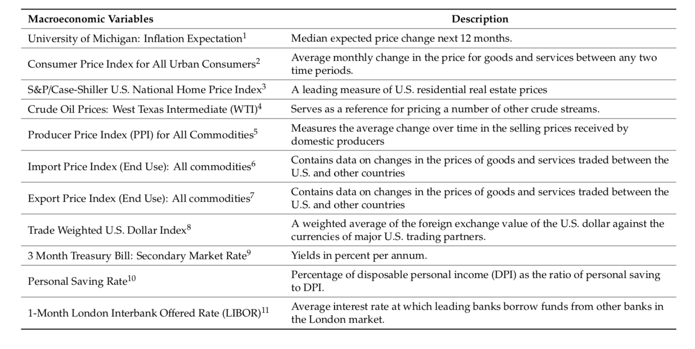
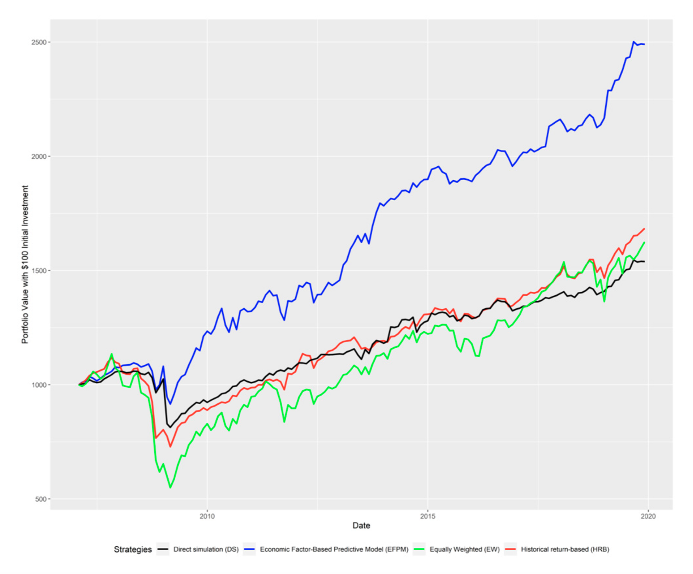

```{r setup, include=FALSE}
knitr::opts_chunk$set(echo = FALSE)
```

# Introduction

## Motivation

- Use modern machine learning techniques to build on well established macroeconomics factors literature with respect to asset price prediction.

- The main goal is to use macroeconomics factors to build an optimal asset portfolio of indexes that protects against extreme losses (left tail returns) while still offering adequate returns.

## Proposal I

- Framework for portfolio optimization:

{width=90%}
 


## Proposal II

- 1: Train the Neural Network with historical macroeconomic factors return as inputs (X) and historical asset returns as outputs (Y).
- 2: Learn the PCC-GARCH model with historical macroeconomic factor data. 
- 3: Simulate a large number of factor returns based on the estimated PCC-GARCH model, accounting for univariate time-varying volatility and multivariate dependence. 
- 4: Feed the the factor returns to the Neural Network to obtain asset returns.
- 5: Use the resulting asset returns to find the weight allocation for next period using mean-CVaR portfolio optimization. 

# Fundamentals

## GARCH(1,1) model 

- In order to model each univariate macroeconomic factor volatility, a GARCH(1,1) model is proposed. 

- Volatility is modeled using a GARCH(1,1) because the majority of financial assets share common 'stylized facts':
  - Heavy Tails: the distribution of returns usually shows heavier tails than Normal or t distribution: extreme losses or gains aren't that rare. 
  - Gain/Loss Asymmetry: large downturn in assets prices do not necessarily reflect equally large upturns. 
  - Volatility Clustering: high volatility events tends to cluster over time. Economic crisis. 
- Thus, using simple asset's standard deviation as a risk measure can be problematic.

## GARCH(1,1) model (2)

Let $R_t$ be the return of an macroeconomic factor at time $t$. It can be modelled as $R_t = \mu + \epsilon_t$, where $\mu$ is the average of the returns. 
A GARCH(1,1) model can be described as: 
\begin{equation}
\begin{aligned}
\epsilon_t = \sigma_tz_t \\
\sigma_{t}^{2} = \omega  + \alpha_{1}\epsilon_{t-1}^{2} + \beta_{1}\sigma_{t-1}^{2}
\end{aligned}
\end{equation}. It is assumed $z_t$ follows a SGED, GED or skewed-t based on goodness of fit. 


## Pair Copula and Dependence Modeling

- GARCH(1,1) model is able to capture univariate volatility. However, it is well known that dependence between financial assets exist.
- During crisis, financial assets exhibits different dependence structures with respect to normal or bullish market conditions: they tend to have a very correlated loss dynamic. 
- Copula-GARCH models are able to capture the multivariate assets dependence while multivariate probability function estimation is not needed or desired. 

## More about copula

- The main advantage of using copulas is that it allows separating the marginal assets distribution (here modeled using GARCH) from the dependence structure. Then, different dependence behaviors can be captured by different copula functions. 

\begin{theorem}
Let $F$ be an n-dimensional joint distribution function with margins $F_1,...F_n$. Then there exists an n-copula $C$ such that for all $y \in R^n$, \begin{equation}
F(\boldsymbol{y}) = F(y_1,...,y_n) = C(F_1(y_1),...,F_n(y_n)).
\end{equation} Furthermore, if $F_1,...,F_n$ are continuous, then $C$ is unique.
\end{theorem}

## More about copula
\begin{corollary}
Let $f$ be the multivariate probability density function, the probability distribution $F$, and $f_1,...,f_n$ the univariate probability density functions of the margins $F_1,...,F_n$. The copula density function of an n-copula $C$ is the function c: $U[0,1]^n \mapsto [0,\infty)$ such that \begin{equation}
      c(u_1,...,u_n)= \frac{\partial^n C(u_1,...,u_n)}{\partial u_1,...,\partial u_n} =                \frac{f(y_1,...,y_n)}{\prod^{n}_{i=1}f_i(y_i)}.
\end{equation}
\end{corollary}

## How this all connects

Using theorems above, the conditional joint distribution can be decomposed, given previous information set, into conditional marginal distributions and conditional copulas. For $t \in (1,...,T)$ let $\boldsymbol{Y}_t|\boldsymbol{I}_{t-1} \sim F(.|\boldsymbol{I}_{t-1})$ and $Y_{i,t}|\boldsymbol{I}_{t-1} \sim F_i(.|\boldsymbol{I}_{t-1})$, then \begin{equation}
F(\boldsymbol{y}|\boldsymbol{I}_{t-1}) = C(F_1(y_1|\boldsymbol{I}_{t-1}),..., F_n(y_n|\boldsymbol{I}_{t-1})|\boldsymbol{I}_{t-1})
\end{equation}

We incorporate GARCH(1,1) equation to the multivariate copula and the white-noise term ${z_t}$ can be derived from the copula structure: \begin{equation}
z_t|\boldsymbol{I}_{t-1} \sim F_{z,t} = C_t(F_{1,t}, ... , F_{n,t}) \end{equation} where $z_t$ can then be estimated from \begin{equation}
\frac{R_t - \mu}{\sigma_t|\boldsymbol{I}_{t-1}} \end{equation}

## Pair Copula (PCC)

- Different copula functions captures different kinds of dependence. 
- t-copula is symmetrical and captures both upper and lower tail dependence. Clayton copula captures lower tail, etc. 
- Computation requirements to estimate multivariate copula parameters increases with dimension of time-series. 
- However, multivariate joint density can be written as a product of pair copula on different conditional distributions.
- Copula parameters are then estimated with log-likelihood optimization along the layers of pair copula trees. 
- Final PCC model is the one that optimizes AIC using Clayton, t, Gumbel and Normal copula.

## Algorithm for the simulation of macroeconomic time series 

- 1: Fit the error term of monthly log-percentage change minus it's average for each macroeconomic variable into the GARCH(1,1) process, based on SGED, GED or skewed-t (if SGED fails to converge):

for $t = 1, 2, ... T$:
\begin{equation}
\begin{aligned}
\epsilon_{i, t-1} = R_t - \mu_t \\
\hat{\sigma}_{i,t}^{2} = \omega  + \alpha_{i,1}\epsilon_{i,t-1}^{2} + \beta_{i,1}\hat{\sigma}_{i,t-1}^{2}
\end{aligned}
\end{equation}

- 2: Use estimated GARCH(1,1) model to construct standardized residual vector \begin{equation}
\frac{R_t - \mu}{\sigma_t|I_{t-1}} \end{equation} for each factor.
- 3: Obtain $[0,1]$ Empirical CDF for each factor. 

## Algorithm for the simulation of macroeconomic time series (2)

- 4: Use Empirical CDF data of each factor to fit canonical vine copulas from t, Clayton, Gumbel and Normal copulas. 
- 5: Simulate N samples, $u_{i,j}$ from canonical vine for each factor $j$.
- 6: To obtain simulated white-noise term $\hat{z}_{i,T}$, calculate quantiles based on fitted SGED distribution of error terms, such that $Q(F(z)) = z$. 
- 7: Determine the next step log-percentage change from its joint distribution using the sample mean between 1 and T, $\mu_{1:T}$, last period conditional volatility, $\hat{\sigma}_{i,T}$, and the simulated white-noise $\hat{z}_{1,T}$ as $R_{T+1} = \mu_{1:T} + \hat{z}_{1,T}\hat{\sigma}_{i,T}$. 


## Neural Networks

- The advantage of using deep neural networks for financial forecasting, as opposed to linear models such as ARIMA, is that they can approximate the relationship between input data and predicted outputs, even in highly complex and correlated scenarios. 

- Most of the studies with neural network use the historical data of the financial assets to explore the hidden relationship between them.

## The Economic Factor-Based Predictive Model (EFPM) {.allowframebreaks}

- This proposal uses neural networks to explore the relationships between macroeconomic factors and financial assets returns.

- A feedforward neural network with one hidden layer and one output layer that takes the simulation of 11 major macroeconomic factors as input and produces the return of 6 vehicle investment assets.
 
- The network maps the input to the output using the function below, where $\phi$ is the sigmoid function $\left(\frac{e^x}{1+e^x}\right)$ and $\alpha$ is a bias term:


$$\hat{y_i} = \phi_{output}\left(\alpha_1 + \sum_{k \rightarrow output}{w_{k,output}\phi\left(\alpha_k+\sum_{j \rightarrow k}w_{jk}x_{ij}\right)}\right)$$

- Find the optimal weights $w_{k,output}$ and $w_{jk}$ minimizing the SSE using gradient descent to iteractively update $w_{jk} \rightarrow w_{jk} - \eta\frac{\partial SSE}{\partial w_{jk}}$ where $\eta$ is the learning rate that controls the size of the step. 

{width=80%}

## Mean CVaR

- Traditional portfolio optimization follows Markowitz mean-variance model. 
- As mentioned earlier, there's a need to model lower tail risk. New risk measures introduced. 
- VaR (Value at Risk): Let $\boldsymbol{w}$ be a vector of portfolio weights. VaR is defined as $VaR_{\beta}(\boldsymbol{w}) = min(l \in R: \psi(\boldsymbol{w},l) \ge \beta)$. It can be interpreted as the portfolio loss with $\beta$ confidence. However, VaR has some limitations (not coherent, numerical difficulties, not convex). 
- CVaR (Conditional Value at Risk): CVaR is defined as \begin{equation} CVaR_\beta(w) = \frac{1}{1-\beta}\int_{f(w,y)\ge VaR_{\beta(w)}}f(w,y)p(y)dy, \end{equation} where $\boldsymbol{y}$ represents returns with density $p(\boldsymbol{y})$ and $f(\boldsymbol{w},\boldsymbol{y})$ is a loss function defined as $f(\boldsymbol{w},\boldsymbol{y}) = -\boldsymbol{w}^T\boldsymbol{y}$. It can be interpreted as the mean loss from $VaR_\beta$ to $-\infty$. 
- CVaR is a coherent risk measure and the optimization w.r.t to a portfolio is well defined and easier to be done. 

## Mean-CVaR portfolio optimization

- An easier discretized version function can be used to calculate $CVaR_\beta$ approximating the integral above:
\begin{equation}
F_\beta(\boldsymbol{w},l) = l + \frac{1}{q(1+\beta)}\sum^{q}_{k = 1}[f(\boldsymbol{w}, \boldsymbol{y}_k)-l]^{+}.\end{equation} Minimizing CVaR is thus the equivalent of minimizing $F_\beta(\boldsymbol{w},l)$. 

## Optimization Problem I
The final mean-CVaR portfolio optimization is then defined as: 
\begin{equation}
\begin{aligned}
\min_{\boldsymbol{w} \in \boldsymbol{W}} F_\beta(\boldsymbol{w},l) = l + \frac{1}{q(1+\beta)}\sum^{q}_{k = 1}S_k \\
s.t. S_k \ge f(\boldsymbol{w}, \boldsymbol{y}_k) - l = -\boldsymbol{w}^T\boldsymbol{y}_k - l \\
S_k \ge 0\\
\sum^{N}_{i=1}w_i = 1\\
\boldsymbol{w}^T\boldsymbol{y} \ge \mu_0\\
\end{aligned}
\end{equation} where $S_k$ is an auxiliary term to approximate $[f(\boldsymbol{w},\boldsymbol{y}_k)-l]^+$ so that the optimization can be solved as a Linear Programming problem (using Simplex or Interior Point). 

## Optimization Problem II

- The simulated macroeconomic factors are fed to Neural Network in order to produce simulated asset returns. 
- As the simulation stems from copula-GARCH(1,1) model, the resulting simulated asset returns inherit the model's characteristics of time-varying volatility, dependence structure and constant mean of the series.
- These returns are used in the portfolio optimization problem to produce optimal weights for the next allocation period based on minimization of $CVaR_\beta$. 
 

# Methodology

## Neural Net-Based Pair Copula GARCH Portfolio Optimization Framework

{width=70%}

## Data Collection {.allowframebreaks}

- 6 Vanguard index mutual funds

Table: Investment Instruments. @Yu2020

  Security Name                         Security Symbol
-----------------                   ----------------------
 Vanguard 500 Index                          VFINX
 Vanguard Small Cap Index                    NAESX
 Vanguard Total Intl Stock Index             VGTSX
 Vanguard Emerging Mkts Stock Index          VEIEX
 Vanguard Total Bond Market Index            VBMFX
 Vanguard Real Estate Index                  VGSLX

- 11 macroeconomic factors

{width=90%}

## Training

- Training period of 60-month interval to get the optimal weight and test out-of-sample data for the following month. Training and testing repeated starting on January 2002 until all data points in sample are evaluated.
- Min–max normalization method on both the monthly log returns of the index funds and the monthly log-percentage change of the macroeconomic variables to accelerate gradient descent algorithm. Data set also normalized.
- 60-month data set split into one training set of 54 data points to form the model, and the remaining 6-month data that is used to tune the hyperparameter, such as number of neurons in the hidden layer. 
- Mean squared error (MSE) of predicted output minimized to select the best network structure.

## Simulation 

- Simulate 5000 log-percentage change of economic variables using the the pair copula-GARCH(1,1) model.
- Use the 5000 simulated log-percentage change of the variables as input for the neural network model and get the 5000 simulated log-percentage returns of investment assets.
- 154 months of sample returns.
- Use the simulated return series of past 60 months as input for the Mean-CVar optimization and get the optimal weights of the portfolio for the next month.
   - confidence level ($\beta$): 99%
   - expected return parameter ($\mu_0$): minimum of 10% of annualized return and average return of past 60 months of assets
   
## Validation

- Portfolio performance for the one-month period is recorded, and the process is repeated the next month using the previous 60 months data again.
- Range from February 2007 to November 2009.
- $1000 invested at the end of January 2007.

## Benchmarking

- The proposed strategy is compared to 3 methods:
   - \textbf{Equally weighted (EW):} index funds in the portfolio are simply allocated equally and rebalanced to equal weights each month.
   - \textbf{Historical return-based (HRB):} historical returns of the index funds are computed directly as inputs to the Mean-CVaR framework (no simulation).
   - \textbf{Direct simulation (DS):} monthly returns of the index funds are simulated by applying historical data into the pair copula-GARCH framework without utilizing the neural network framework and information from economic variables.

# Results

## Performance comparison

- Proposed framework using the neural network and considering macroeconomic factors outperforms all benchmark methods.

{width=60%}

## Detailed performance comparison

Table: Summary of performance in the 4 strategies. @Yu2020

  Summary Statistics             EFPM         HRB          DS          EW
----------------------       ----------     --------    ---------    --------
 Annualized Return             7.4%           4.1%         3.4%        3.9%
 Annualized Volatility         8.6%           8.3%         7.2%        13.8%
 Sharpe Ratio                  0.57           0.20         0.13        0.10
 Maximum Drawdown              -16.4%       -34.8%       -23.2%       -51.5%
 Monthly 99% CVaR              -9.3%        -13.5%       -13.0%       -15.6%

## References {.allowframebreaks}
