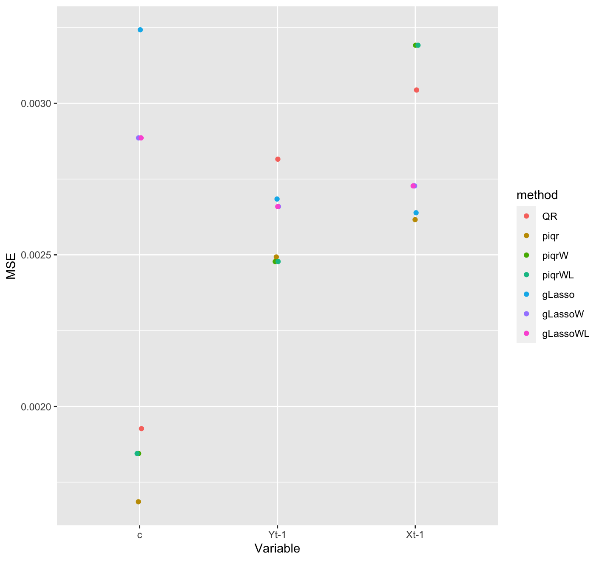
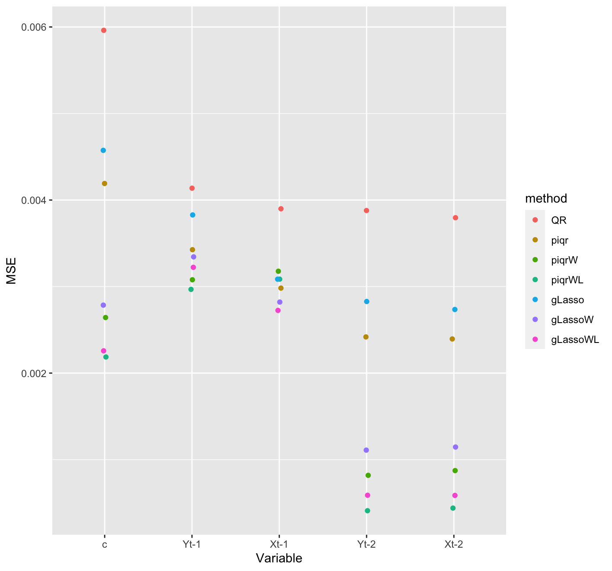
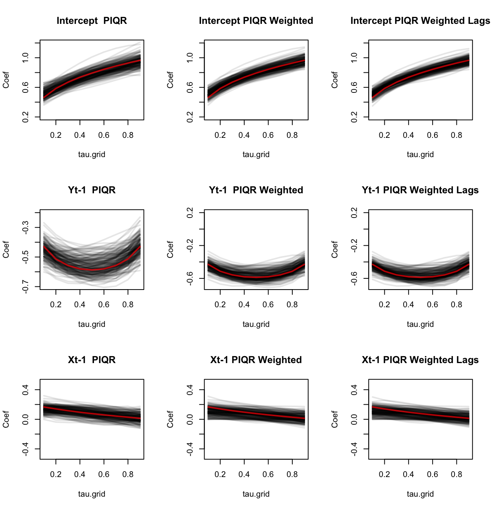
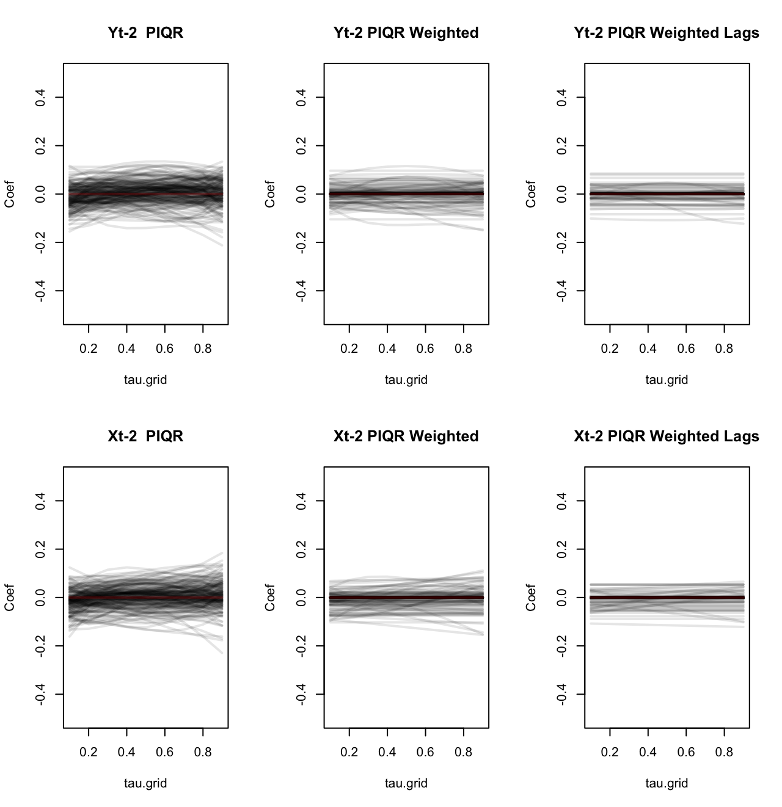
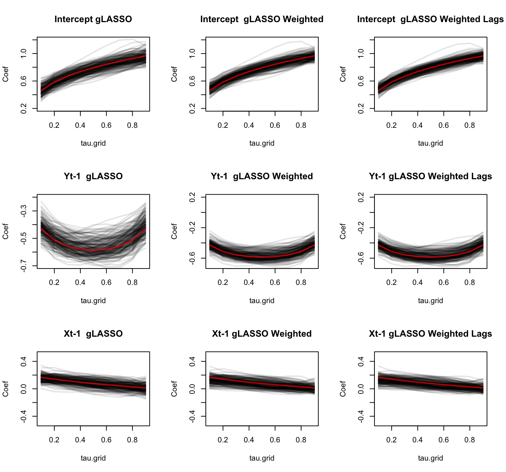
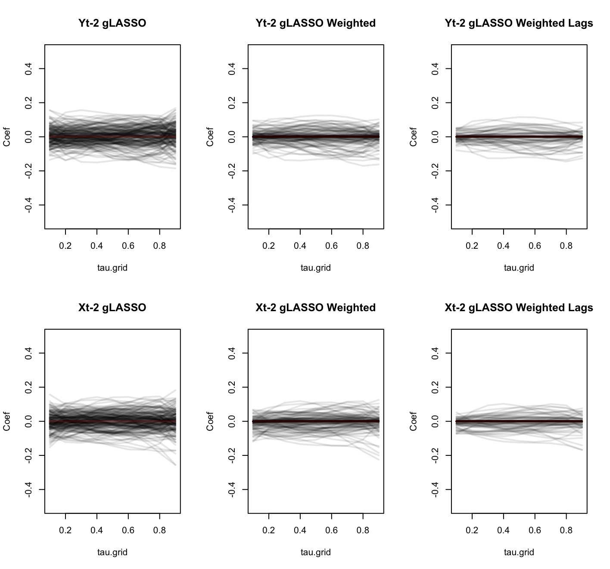

# Introduction

Quantile regression, introduced in @Koenker1978, provides a model for the conditional distribution of the response variable $Y$ on the vector of covariates $\mathbf{X}$ at different quantile levels, denoted here as $\tau\in(0,1)$, thus, offering a description for the whole conditional distribution. It offers a more robust estimation for outliers, as opposed to classical linear regression that only evaluates the conditional mean at a specific location. [@Davino2014] In @Koenker2005, the Quantile Autoregressive (QAR) model is introduced, where the $\tau$-th conditional quantile function of the response variable $Y_t$ is expressed as a linear function of the lagged values of $Y$ and all the autoregressive coefficients can depend on $\tau$. Quantile regression estimation for other traditional time series models are described in @Koenker2018, such as ARMA and ADL models. @Galvao2013 generalize the QAR model to a framework that introduces exogenous stationary covariates, the Quantile Autoregressive Distributed Lag (QADL) model, demonstrating it can deliver good insights on asymmetric dynamics.

In quantile regression, we get the conditional quantile function for a determined $\tau$. Therefore, for each desired quantile, there will be a regression model and estimation. This brings complexity to certain operations, since we will have $M$ different estimations, where $M$ is the number of quantiles we wish to evaluate. For example, if we want to perform variable selection using regularization techniques, such as LASSO or adaptive LASSO, we might have different variables selected for each $\tau$. @Frumento2016 proposes an approach for quantile regression that estimates the coefficients for a given grid of $\tau$'s in one single minimization problem. Adding to this approach, it is possible to perform a global selection of variables for a grid of quantiles. @Sottile2020 study global coefficient estimation and variable selection in cross-sectional data using LASSO, demonstrating being able to efficiently approximate the true model with high probability. 

In this work, we propose a global coefficient estimation and variable selection method based on the estimator presented in @Sottile2020. The proposal introduces the group LASSO penalty, suggested in @Yuan2006, and is applied in a Quantile Autoregressive Distributed Lag (QADL) model. Furthermore, since we are in a time series context, the variable selection penalization applies higher penalties to higher lags, as proposed in @Konzen2016. The paper is organized as follows: Chapter \ref{fundamentals} describes the main concepts used in this work and the proposed estimator, Chapter \ref{methodology} explains how the QADL process was generated and how the simulation process was setup, Chapter \ref{results} analyses the results of the simulation and comparison with other methods, and Chapter \ref{conclusion} provides a final discussion enlightening future work.

# Fundamentals \label{fundamentals}

In this section, the fundamental concepts used in this work are presented. We start defining the Quantile Autoregressive Distributed Lag Model, describe the proposed estimator and express the variable selection method.

## Quantile Autoregressive Distributed Lag Model (QADL)

Consider an Autoregressive Distributed Lag model described by the equation:
\begin{equation}
Y_t = \alpha_0 + \alpha_1Y_{t-1} +  \cdots + \alpha_pY_{t-p} + \theta_1\mathbf{X}_{t-1}^\intercal + \cdots + \theta_q\mathbf{X}_{t-q}^\intercal + \varepsilon_t 
\label{eq:adl}
\end{equation}
where $t = 1, ..., T$, $Y_t$ is the response variable, $Y_{t-j}$ the lag of the response variable and $\mathbf{X}_{t-q}$ is the lagged covariates vector with dimension $D$. $\varepsilon_t$ is a white noise.

As in @Koenker2006, we are interested in studying a class of quantile autoregressive models which coefficients can be dependent of $\tau$. Therefore, lets consider the following process, with ${U_t}$ as a sequence of i.i.d standard uniform random variables, $\alpha$ and $\theta$ as unknown functions $[0,1] \rightarrow \mathbb{R}$ to be estimated:
\begin{equation}
Y_t = \alpha_0(U_t) + \alpha_1(U_t)Y_{t-1} +  \cdots + \alpha_p(U_t)Y_{t-p} + \theta_1(U_t)\mathbf{X}_{t-1}^\intercal + \cdots + \theta_q(U_t)\mathbf{X}_{t-q}^\intercal
\label{eq:adltau}
\end{equation}

Then, given that for any monotone increasing function $g$ and a standard uniform random variable $U$ the following is true:

$$
Q_{g(U)}(\tau) = g(Q_U(\tau)) = g(\tau)
$$

Assuming the right side of the equation \ref{eq:adltau} is monotone and increasing on $U_t$, we can say that the $\tau_{th}$ conditional quantile function of $Y_t$ is:

\begin{equation}
Q_{Y_t}(\tau|\Im_t) =  \alpha_0(\tau) + \alpha_1(\tau)Y_{t-1} + \cdots + \alpha_p(\tau)Y_{t-p} + \theta_1(\tau)\mathbf{X}_{t-1}^\intercal + \cdots + \theta_q(\tau)\mathbf{X}_{t-q}^\intercal
\label{eq:qadl}
\end{equation}
where $\Im_t$ is the $\sigma$-field generated by ${Y_s, s\leq t}$. 

Now let $\mathbf{Z_t}^\intercal$ be the covariates matrix with dimension $D$ and $\beta(\tau)$ a vector of the coefficients that describe the relationship between the covariates $\mathbf{Z}$ and the $\tau$-th quantile of the response variable, $\tau \in (0,1)$.

Then, equation \ref{eq:qadl} can be expressed in the form of 
\begin{equation}
Q_{Y_t}(\tau|\Im_t) = \mathbf{Z_t}^\intercal\beta(\tau)
\label{eq:qadlred}
\end{equation}

Given the QADL model described in \ref{eq:adl}, $\mathbf{Z_t}^\intercal$ and $\beta(\tau)$ are, respectively, 
$$
\mathbf{Z_t}^\intercal = (1, Y_{t-1}, \dots, Y_{t-p}, \mathbf{X}_{t-1}, \dots, \mathbf{X}_{t-p})
$$ 
and
$$
\beta(\tau)^\intercal = (\alpha_0(\tau), \alpha_1(\tau), \dots, \alpha_p(\tau), \theta_1(\tau), \cdots , \theta_q(\tau))
$$
This representation, besides parsimonious, allows us to capture the nuances in the dependency structure of $\mathbf{Z}$ and $Y$. It is important to highlight that, as in the QAR model and other linear quantile regression applications, the QADL process is subject to quantile crossing (@Koenker2005), which is when the estimated quantile functions cross. This violates the principle that distribution functions and their associated inverse functions are monotone increasing. However, it is a valid local approximation over a region of interest.

## Global coefficient estimation and variable selection

In a standard quantile regression (QR) approach, we would estimate the $D$-dimensional vector $\beta(\tau)$ for each $\tau$ one at a time minimizing the sample average of the check function $\rho_\tau$:
$$
\hat{\beta}(\tau) = \arg\min_b \sum_{i=1}^N{\rho_\tau(Y_i - \mathbf{Z_i}^\intercal b)}
$$
where $\rho_\tau(v) = v(\tau - \mathbb{I}_{[v<0]})$. Thus, to find the $\beta(\tau)$ function that minimizes the loss function for all $\tau$, we have the following minimization problem:

\begin{equation}
\hat{\beta}(\tau) = \arg\min_b \sum_{i=1}^N{\int_{0}^{1}\rho_\tau(Y_i - \mathbf{Z_i}^\intercal b) d\tau}
\label{eq:betafunc}
\end{equation}

@Frumento2016 suggested a different approach: modeling the coefficient functions $\beta(\tau)$ as parametric functions of the order of the quantile. Consider $\varphi$ a vector of model parameters, then we can describe the quantile function as: 

\begin{equation}
Q(\tau|\mathbf{Z},\varphi) = \mathbf{Z}^\intercal\beta(\tau|\varphi)
\label{eq:qrcm}
\end{equation}

As stated in @Sottile2020, this method improves the efficiency and interpretation of the results, allowing us to maintain the quantile regression structure in \ref{eq:qadlred} but modeling it parametrically. 

To model $\beta(\tau|\varphi)$, a good practice is to use a flexible model, such as a $k$-th degree polynomial function:

$$
\beta_j(\tau|\varphi) = \varphi_{j0} + \varphi_{j1}\tau + \cdots + \varphi_{jk}\tau^k
$$
where $j = 1, \dots,D$ and $D$ is the number of covariates of the model. $\varphi$ will have dimensions $Q\times(k+1)$, so each covariate has $k+1$ associated parameters. 

### Estimation

Define $\varphi(\tau)$ a set of $L$ known functions of $\tau$, with $L = 1,2,\dots$, and $\delta$ a matrix with dimensions $D \times L$, where $D$ is the number of covariates of the model. Now, consider the following linear parametrization: 

\begin{equation}
\beta(\tau|\varphi) = \delta\varphi(\tau)
\label{eq:betac}
\end{equation}
where $\varphi(\tau)$ is an $L \times M$ matrix. The resulting dimensions of $\beta(\tau|\varphi)$ is $D \times M$, being $M$ the size of the grid of quantiles we are estimating. Thus, we have that:

\begin{equation}
\beta_j(\tau|\varphi) = \delta_{1j}\varphi_1(\tau) + \dots + \delta_{Mj}\varphi_M(\tau)
\label{eq:betaj}
\end{equation}

Hence, we can rewrite equation \ref{eq:qrcm} as:

\begin{equation}
Q(\tau|\mathbf{Z},\varphi) = \mathbf{Z}^\intercal\delta\varphi(\tau)
\label{eq:qrcme}
\end{equation}

Since $\varphi(\tau)$ is known, our goal is to find $\delta$ that minimizes the loss function of the standard QR, so \ref{eq:betafunc} can be rewritten as:

\begin{equation}
\hat{\beta}(\tau|\varphi) = \arg\min_{\delta} \sum_{i=1}^N{\int_{0}^{1}\rho_\tau(Y_i - \mathbf{Z_i}^\intercal \delta\varphi(\tau))d\tau}
\label{eq:betafunc2}
\end{equation}


### Variable selection

To perform a LASSO variable selection, equation \ref{eq:betafunc2} is modified to introduce an $l^1$-norm penalizing factor (@Sottile2020):

\begin{equation}
\hat{\beta}(\tau|\varphi) = \arg\min_{\delta} \sum_{i=1}^n{\int_{0}^{1}\rho_\tau(Y_i - \mathbf{Z_i}^\intercal \delta\varphi(\tau))d\tau} + \lambda \sum_{j=1}^{D}\sum_{h=1}^{L}|\delta_{jh}|
\label{eq:betafuncpen}
\end{equation}
with $\lambda > 0$ as a tuning parameter. Thus, minimization is done subject to $\sum_{j=1}^{D}\sum_{h=1}^{L}|\delta_{jh}| \leq s$, where $s$ is a defined bound to the model parameters. 

An alternative to overcome the inconsistencies that LASSO selection can face is the adaptive LASSO, often denoted as AdaLASSO, method proposed by @Zou2006, where different weights $\omega_j$ are applied to different coefficients. In this approach, variables with lower estimated coefficient, which indicate they are less relevant, will have a great weight $\omega_j$ resulting in a higher penalty. In this scenario, \ref{eq:betafuncpen} would have an extra parameter to represent the weight $\omega_j$:

\begin{equation}
\hat{\beta}(\tau|\varphi) = \arg\min_{\delta} \sum_{i=1}^n{\int_{0}^{1}\rho_\tau(Y_i - \mathbf{Z_i}^\intercal \delta\varphi(\tau))d\tau} + \lambda \sum_{j=1}^{D}\sum_{h=1}^{L}\omega_j|\delta_{jh}|
\label{eq:betafuncpenAda}
\end{equation}

The $\delta$ parameter being estimated is a $D \times L$ matrix, where D is the number of covariates in the model, so a covariate is represented in a row. In this scenario, it is relevant to use the idea from @Yuan2006 to penalize the variables of the $\delta$ matrix in a grouped manner. The adaptive group LASSO estimator applies an $l^2$-norm penalization:

\begin{equation}
\hat{\beta}(\tau|\varphi) = \arg\min_{\delta} \sum_{i=1}^n{\int_{0}^{1}\rho_\tau(Y_i - \mathbf{Z_i}^\intercal \delta\varphi(\tau))d\tau} + \lambda \sum_{j=1}^{D}\omega_j\Vert\delta_{j}\Vert
\label{eq:betafuncpenAdaGroup}
\end{equation}
where 
$$
\Vert\delta_{j}\Vert = \sqrt{\sum_{h=1}^L\delta_{j,h}^2}
$$
and 
$$
\omega_j = \left(|\hat{\delta}_{j}| e^{-\alpha}\right)^{-p}
$$
being $\hat{\delta}$ the $\delta$ matrix estimated as described in \ref{eq:betafunc2}.

In a time series context, we are estimating the coefficients for each lagged variable, thus, @Park2013 consider applying higher weights for higher lags, as it is usual that more recent variables are more relevant. @Konzen2016 apply this idea to propose the WLadaLASSO, that has its original form described as $\omega_j = \left(|\hat{\beta_j}|e^{-\alpha t}\right)^{-p}$, with $p>0$, $\alpha \geq 0$ and $t$ representing the lag order. For \ref{eq:betafuncpenAdaGroup}, we will have that $\omega_j = \left(|\hat{\delta}_{j}| e^{-\alpha t}\right)^{-p}$.


# Methodology \label{methodology}

In this chapter, the process used to simulate the QADL model is presented, as well as the parameters used in the implementation of the proposed estimators and the metrics considered to evaluate the results.

## Simulation \label{simulation}

As stated in Section 2, when studying quantile regression, we need to assume certain restrictions to avoid situations like quantile crossing. To allow  more flexibility on the $\beta(U_t)$ parameters, we usually restrict the support of the covariates to be bounded in $[0, +\infty]$. In a time series context, where we are modeling a process like \ref{eq:adltau}, we need to impose these restriction not only to the right side of the equation, as usually enough in linear quantile regression, but also in the response variable, as $Y_t$ and $Y_{t-1}$ are equal in distribution. To simulate \ref{eq:adltau} ensuring that the right-hand side of the equation is monotone and increasing in $U_t$, we will use a family of hyperplanes, as discussed in @Horta2021. 

Consider $v_d:(0,1)\rightarrow \R$ where $d\in \{0,1\}^2$ as non-decreasing and left-continuous functions that satisfy: 

\begin{longlist}
\item[1.]
$v_{11} = v_{10} +v_{01} - v_{00}$
\item[2.]
$\tau\rightarrow v_{11}(\tau)$ is non-decreasing.
\end{longlist}

Now, if $\mathbf{X}$ is a random vector in ${\R}^3$ and $U \sim U(0,1)$ is a scalar random variable independent of $\mathbf{X}$, then we can define the random variable $Y$ as
$$
Y = v_{00}(U) + (v_{10}(U)-v_{00}(U))X_2 + (v_{01}(U) - v_{00}(U))X_3 
$$
and it will satisfy, for any $\tau \in (0,1)$ and all $x$,  
$$
Q_{Y|X}(\tau|x) = \beta_0(\tau) +  \beta_1(\tau)x_2 + \beta_2(\tau)x_3
$$
where $\beta_0(\tau) = v_{00}$,  $\beta_1(\tau) = v_{10}-v_{00}$ and $\beta_2(\tau) = v_{01} - v_{00}$.

### The generated QADL models \label{qadl_gen}

To study the proposed estimator, we simulate the $Y$ and $X$ variables with the following model:
$$
Q_{Y_t}(U_t|\Im_{t-1}) = \alpha_0(U_t) + \alpha_1(U_t)Y_{t-1} + \theta_1(U_t)X_{t-1}
$$
and 
$$
Q_{X_t}(U_t|\Im_{t-1}) = \alpha_0(U_t) + \alpha_1(U_t)X_{t-1} + \theta_1(U_t)Y_{t-1}
$$
where $v_{00}(\tau) = QBeta(\tau,3,1)$, $v_{10}(\tau) = QBeta(\tau,1,3)$, $v_{01}(\tau) = QBeta(\tau,5,1)$, $\alpha_0(U_t) = v_{00}(U_t)$, $\alpha_1(U_t) = v_{10}(U_t) - v_{00}(U_t)$ and $\theta_1(U_t) = v_{01}(U_t) - v_{00}(U_t)$.

```{r, echo=FALSE, message=F, warning=F}
set.seed(205650)
source('qardl-gen.r')
qardl = simulate_qardl(N = 10001)
Y = qardl$Y
Z = qardl$Z
```

Figure \ref{fig:vd} illustrates how the chosen $v_d$ function behave on the grid of $\tau$'s. $v_{00}$, $v_{01}$ and $v_{10}$ are the quantile functions of the Beta distribution given the parameters described above. Then, $v_{11}$ is the resulting function of the operation $v_{10} +v_{01} - v_{00}$.

A simulation of a time series of 10000 observations using the method described above is illustrated in Figure \ref{fig:Y}.

Figure \ref{fig:Ycorr} presents the autocorrelation function and the partial autocorrelation function of the process generated by the method described, the correlation between $Y_t$ and $Y_{t-1}$ as well as the correlation between $Y_t$ and $X_{t-1}$. 

```{r figs, echo=FALSE, warning=F,fig.cap="\\label{fig:vd}Chosen $v_d$ Functions Behavior"}

par(mfrow=c(2,2))
# Conditional density of Y[t] given Y[t-1] = 1 and X[t-1]=0
dbplot(a10,b10, title="Yt given Yt-1=1 and Xt-1=0", y_lab="v10 function")
# Conditional density of Y[t] given Y[t-1] = 0 and X[t-1]=1
dbplot(a01,b01, title="Yt given Yt-1=0 and Xt-1=1", y_lab="v01 function")
# Conditional density of Y[t] given Y[t-1]=0 and X[t-1]=0
dbplot(a00,b00, title="Yt given Yt-1=0 and Xt-1=0", y_lab="v00 function")
# Conditional density of Y[t] given Y[t-1]=1 and X[t-1]=1
tau.grid = seq(from=.01,to=.99, by=.02)
plot(v11(tau.grid), 1/q11(tau.grid), xlim=c(0,1), main = "Yt given Yt-1=0 and Xt-1=0", type="l", ylab="v11", xlab="tau.grid")
```


```{r Yfigs, echo=FALSE, warning=F, fig.height=3,fig.cap="\\label{fig:Y}Y time series"}
par(mfrow=c(1,2))
hist(Y, border=NA, breaks="FD")
ts.plot(Y)
```


```{r Ycorr, echo=FALSE, warning=F, fig.width=7,fig.height=6, fig.cap="\\label{fig:Ycorr}ACF,PACF and correlations of Yt and Xt"}

T = length(Y)
par(mfrow=c(2,2))
acf(Y, lwd=16, lend=3, col='gray')
pacf(Y, lwd=16, lend=3, col='gray')
plot(Y[2:T]~Y[1:(T-1)], pch=16, col=rgb(0,0,0,.4), ylab="Yt", xlab="Yt-1")
plot(Y[2:T]~Z[1:(T-1)], pch=16, col=rgb(0,0,0,.4), ylab="Yt", xlab="Xt-1")
```

## Estimation and evaluation

To guarantee a fair comparison between the method proposed by @Sottile2020 and the innovations included in the present work, we implemented the _global-qr_^[https://github.com/taisbellini/series-temporais/tree/main/trabalho_series] function, a re-implementation of the _piqr_ function from @Sottile2020 using the CVXR R-package (@cvxr2020) for convex optimization, minimizing the objective function described in \ref{eq:betafuncpen}. The difference is that, instead of the integral of the $\tau$ grid, we used the sum of the $M$ $\tau$'s of the grid. The results of the _global-qr_ function are asymptotically equivalent to the estimated coefficients of the _piqr_ function. Figure \ref{fig:piqrcomp} illustrate the estimated coefficients $\alpha_0$, $\alpha_1$ and $\theta_1$ from section \ref{simulation}, respectively, using the _piqr_ function and the equivalent _global-qr_ implementation with a $\tau$ grid of size 50. Furthermore, we added parameters to allow performing adaptive LASSO penalization, described in \ref{eq:betafuncpenAda}, as well as the WLadaLASSO penalization from @Konzen2016. Also, there are parameters to replace the traditional LASSO penalization from \ref{eq:betafuncpen} by the group LASSO penalization, described by \ref{eq:betafuncpenAdaGroup}.

```{r alpha_0, echo=FALSE, warning=F, out.width="52%", out.height="22%", fig.show='hold',fig.align='center', fig.cap="\\label{fig:piqrcomp} Coefficient estimation"}
knitr::include_graphics(c('img/comp_piqr_a0_noreal.png', 'img/comp_piqr_a1_noreal.png', 'img/comp_piqr_t1_noreal.png'))
```

To test the proposed approach, we used Monte Carlo simulations with 200 replications using the method described in section \ref{simulation} to generate QADL processes of 500 observations. We generates three different processes: the first, as described in \ref{qadl_gen}; the second, replacing $Y_{t-1}$ and $X_{t-1}$ by $Y_{t-2}$ and $X_{t-2}$,respectively; the last, replacing $Y_{t-1}$ by $Y_{t-5}$.

```{r, echo=FALSE, message=F, warning=F}
set.seed(205650)
source('qardl-gen.r')
qardl = simulate_qardl(N = 10001, Ylag = 2, Xlag = 2)
Y2 = qardl$Y
Z2 = qardl$Z
```

In Figure \ref{fig:Ycorr2}, the autocorrelation function and the partial autocorrelation function of the process generated with $Y_{t-2}$ and $X_{t-2}$ are illustrated, as well as the correlation between $Y_t$ and $Y_{t-1}$, $Y_t$ and $Y_{t-2}$, $Y_t$ and $X_{t-1}$, and $Y_t$ and $X_{t-2}$.

```{r Ycorr2, echo=FALSE, warning=F, fig.width=7,fig.height=6, fig.cap="\\label{fig:Ycorr2}ACF,PACF and correlations of Yt and Xt"}

T = length(Y)
par(mfrow=c(3,2))
acf(Y2, lwd=16, lend=3, col='gray')
pacf(Y2, lwd=16, lend=3, col='gray')
plot(Y2[2:T]~Y2[1:(T-1)], pch=16, col=rgb(0,0,0,.4), ylab="Yt", xlab="Yt-1")
plot(Y2[3:T]~Y2[1:(T-2)], pch=16, col=rgb(0,0,0,.4), ylab="Yt", xlab="Yt-2")
plot(Y2[2:T]~Z2[1:(T-1)], pch=16, col=rgb(0,0,0,.4), ylab="Yt", xlab="Xt-1")
plot(Y2[3:T]~Z2[1:(T-2)], pch=16, col=rgb(0,0,0,.4), ylab="Yt", xlab="Xt-2")
```

```{r, echo=FALSE, message=F, warning=F}
set.seed(205650)
source('qardl-gen.r')
qardl = simulate_qardl(N = 10001, Ylag = 5, Xlag = 1)
Y5 = qardl$Y
Z1 = qardl$Z
```

In addition, Figure \ref{fig:Ycorr3} demonstrates the autocorrelation and partial autocorrelation functions of the process generated with $Y_{t-5}$ and $X_{t-1}$, and also the correlation between $Y_t$ and $Y_{t-1}$, $Y_t$ and $Y_{t-5}$, $Y_t$ and $X_{t-1}$, and $Y_t$ and $X_{t-2}$.

```{r Ycorr3, echo=FALSE, warning=F, fig.width=7,fig.height=6, fig.cap="\\label{fig:Ycorr3}ACF,PACF and correlations of Yt and Xt"}

T = length(Y)
par(mfrow=c(3,2))
acf(Y5, lwd=16, lend=3, col='gray')
pacf(Y5, lwd=16, lend=3, col='gray')
plot(Y5[2:T]~Y5[1:(T-1)], pch=16, col=rgb(0,0,0,.4), ylab="Yt", xlab="Yt-1")
plot(Y5[6:T]~Y5[1:(T-5)], pch=16, col=rgb(0,0,0,.4), ylab="Yt", xlab="Yt-5")
plot(Y5[2:T]~Z1[1:(T-1)], pch=16, col=rgb(0,0,0,.4), ylab="Yt", xlab="Xt-1")
plot(Y5[3:T]~Z1[1:(T-2)], pch=16, col=rgb(0,0,0,.4), ylab="Yt", xlab="Xt-2")
```


Since the goal of this work is to compare the coefficient estimation and variable selection methods, we fixed the $\lambda$ parameter in 1, and the $p$ and $\alpha$ parameters to calculate $\omega_j$ from \ref{eq:betafuncpenAdaGroup} in 1 and 0.5, respectively. Additionally, the number of functions in $\varphi(\tau)$ is 5 and the tolerance to set the coefficient to zero is $1e^{-6}$. For each iteration, we globally estimated the coefficients using _global-qr_ function with the possible permutations: $l^1$ penalization ( _piqr_ equivalent) and $l^2$ penalization (group LASSO), with and without weights (adaptive LASSO), considering or not the lags to compute the weight (WLadaLASSO). This results in 6 different estimation. In addition, they were compared to the regular quantile regression function from the _quantreg_ R package. 

Monte Carlo experiments comparing the 7 different methods for coefficient estimation and variable selection were performed for each generated process. The dataset used for validation was created with an intercept column and 10 lags of each covariate generated resulting in 21 columns, including the intercept.

We analyzed two aspects: the coefficients estimation and the chosen variables by the variable selection. The metric used was Mean Squared Error (MSE) by coefficient, such as we can evaluate estimation in general and effectivity in selecting variables.

# Results \label{results}

When testing in a dataset that didn't have zero coefficient variables, the implementation equivalent to the _piqr_ method from @Sottile2020 had consistently better results across all variables, as noted in the plot of the mean squared error results for the estimation of the coefficient for each variable in Figure \ref{fig:lag1_results}. Interestingly, this method provided better results than the traditional quantile regression implemented in _quantreg_ package. As expected, the estimations using WLadaLASSO did not differ from adaLASSO, as we only had one lag, so the penalization was the same for all variables in both cases.


```{r mse_lag1, echo=FALSE, warning=F, out.width="90%", fig.pos = 'H', fig.cap="\\label{fig:lag1_results} MSE in dataset with one lag"}

```

When adding covariates to the dataset, including variables $Y$ and $X$ with two lags, we can observe that the proposed penalization innovations provide better results when estimating coefficients and selecting the variables. When comparing the _piqr_ implementation with group LASSO, the results are similar, and the method from @Sottile2020 has lower MSE, as illustrated in Figure \ref{fig:mse_lag2}. 

```{r mse_lag2, echo=FALSE, warning=F, out.width="90%", fig.pos='H', fig.cap="\\label{fig:mse_lag2} MSE in dataset with two lags"}

```

However, when adding the weights to the penalization, one can notice a better performance, specially in selecting the variables. Figures \ref{fig:piqr} and \ref{fig:piqr_zero} illustrate the comparison between the coefficient estimation for each variable with different methods. Notice from Figure \ref{fig:piqr_zero} that the weighted approaches set the zero coefficients correctly more often. 

```{r piqr, echo=FALSE, warning=F, out.width="90%", fig.pos = 'H', fig.cap="\\label{fig:piqr} PIQR estimation"}

```

```{r piqr_zero, echo=FALSE, warning=F, out.width="90%",fig.pos = 'H', fig.cap="\\label{fig:piqr_zero} PIQR variable selection"}

```

Similar results are observed when applying the weighted penalization to the group LASSO approach, as illustrated in Figures \ref{fig:gLasso} and \ref{fig:gLasso_zero}.

```{r gLasso, echo=FALSE, warning=F, out.width="90%",fig.pos = 'H', fig.cap="\\label{fig:gLasso} Group LASSO coefficient estimation"}

```

```{r gLasso_zero, echo=FALSE, warning=F, out.width="90%", fig.pos = 'H',fig.cap="\\label{fig:gLasso_zero} Group LASSO variable selection"}

```


# Final discussions and future work \label{conclusion}

@Frumento2016 and @Sottile2020 introduced an important solution to the complexity of variable selection in quantile regression modeling. In this work, it was proposed to evaluate increments in the LASSO penalization, considering the context of the data and incorporating the group LASSO and WLadaALASSO penalization to the method. The results suggest that a weighted penalized approach can provide better results in selecting the variables and at estimating the coefficients. In particular, both LASSO and group LASSO penalization with higher weights for higher lags combinations had lower mean squared error to estimate most of the tested scenarios and set the zero coefficients correctly more often.

In this work, the aim was to compare the proposed additions to @Sottile2020 framework and traditional quantile regression. For further studies, it is interesting to evaluate different parametrization to the proposed method, finding the optimal $lambda$, $p$, $\alpha$, and minimum $\tau$-grid. Furthermore, different QADL data generation processes should be explored, in particularly schenarios where higher lags have non-zero coefficients, as well as adding more lags to the testing database. Also, it is interesting to apply the methods in real data scenarios.


<!-- %%%%%%%%%%%%%%%%%%%%%%%%%%%%%%%%%%%%%%%%%%%%%%%%%%%%%%%%%%%%% -->
<!-- %%                  The Bibliography                       %% -->
<!-- %%                                                         %% -->
<!-- %%  imsart-nameyear.bst  will be used to                   %% -->
<!-- %%  create a .BBL file for submission.                     %% -->
<!-- %%                                                         %% -1`->
<!-- %%  Note that the displayed Bibliography will not          %% -->
<!-- %%  necessarily be rendered by Latex exactly as specified  %% -->
<!-- %%  in the online Instructions for Authors.                %% -->
<!-- %%                                                         %% -->
<!-- %%  MR numbers will be added by VTeX.                      %% -->
<!-- %%                                                         %% -->
<!-- %%  Use \cite{...} to cite references in text.             %% -->
<!-- %%                                                         %% -->
<!-- %%%%%%%%%%%%%%%%%%%%%%%%%%%%%%%%%%%%%%%%%%%%%%%%%%%%%%%%%%%%% -->
