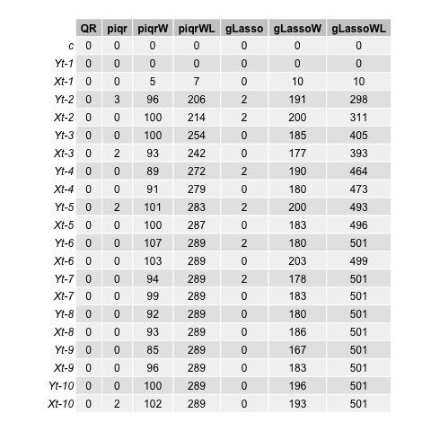

```{r setup, include=FALSE, message=FALSE, warning=FALSE}
knitr::knit_hooks$set(plot = function(x, options)  {
  paste0(knitr::hook_plot_tex(x, options), "\n\\FloatBarrier\n")
})
```

# Introduction

Quantile regression, brought to light in its modern guise by @Koenker1978, provides a model for the conditional quantile of the response variable $Y$ given the vector of covariates $\boldsymbol{X}$, at different quantile levels, denoted here as $\tau\in(0,1)$. Thus, it offers a parsimonious description for the whole conditional distribution of the response. Importantly, quantile regression also yield estimators that are more robust to the presence of outliers, as opposed to classical linear regression methods that only evaluate the conditional mean at a specific location [@Davino2014]. In a time series context, @Koenker2005 introduces the Quantile Autoregressive (QAR) model, where the $\tau$-th conditional quantile of the response variable $Y_t$ is expressed as an affine function of the lagged values of $Y$, and all the autoregressive coefficients can depend on $\tau$. Quantile regression methods for other traditional time series models, such as ARMA and ADL models, are described in @Koenker2018. @Galvao2013 generalize the QAR model to a framework that includes exogenous stationary covariates, the Quantile Autoregressive Distributed Lag (QADL) model, demonstrating it can deliver good insights on asymmetric dynamics.

Quantile regression models are customarily presented by specifying, for each quantile level $\tau$, the functional form for the conditional $\tau$th quantile of the response. Therefore, for each desired quantile level, there corresponds one regression equation and, with regards to estimation, one optimization procedure. This brings complexity to certain operations, since we will have $M$ different estimations, where $M$ is the cardinality of the set $\mathcal{T}$ of quantile levels we wish to evaluate. One scenario where this may raise difficulties occurs when we desire to perform variable selection using regularization techniques, such as LASSO or adaptive LASSO, as we might obtain a different set of selected variables for each quantile level. @Frumento2016 propose an approach for quantile regression that estimates the coefficients for a given grid of $\tau$'s through a single minimization problem. Adding to this approach, it is possible to perform global selection of variables for a grid of quantile levels. @Sottile2020 study global coefficient estimation and variable selection in cross-sectional data using LASSO, demonstrating its ability to efficiently approximate the true model with a high probability. 

In this work, we propose a method for global variable selection and coefficient estimation, similarly to (and partially inspired by) the ideas put forth by @Sottile2020, in a time series framework. Our proposal introduces the group (ada)LASSO penalty [@Yuan2006], and we apply it to Quantile Autoregressive Distributed Lag (QADL) models [@Galvao2013]. Furthermore, since we are considering a time series context, our variable selection method applies higher penalties to higher lags, as proposed by @Konzen2016. The paper is organized as follows: Chapter \ref{fundamentals} describes the main concepts used in this work and the proposed estimator; Chapter \ref{methodology} explains how the QADL process was generated and how the simulation process was set up; Chapter \ref{results} analyses the results of the simulation and comparison with other methods, and Chapter \ref{conclusion} provides a final discussion enlightening future work.

# Fundamentals \label{fundamentals}

In this section, the fundamental concepts used in this work are presented. We start by defining the Quantile Autoregressive Distributed Lag Model, then we describe the proposed estimator and corresponding variable selection method.

## Quantile Autoregressive Distributed Lag Model (QADL)

Consider a classic Autoregressive Distributed Lag model described by the stochastic difference equations:
\begin{equation}
Y_t = \alpha_0 + \alpha_1Y_{t-1} +  \cdots + \alpha_pY_{t-p} + \theta_1\boldsymbol{X}_{t-1}^\intercal + \cdots + \theta_q\boldsymbol{X}_{t-q}^\intercal + \varepsilon_t,\qquad t\in\mathbb{Z},
\label{eq:adl}
\end{equation}
where $Y_t$ is the response variable, $Y_{t-j}$ the lag of the response variable and $\boldsymbol{X}_{t-q}$ is the lagged vector of covariates, with dimension $D$. Here $(\varepsilon_t:t\in\mathbb{Z})$ is white noise, uncorrelated with lagged values of $Y$ and $\boldsymbol{X}$, and the $\alpha$'s and $\theta$'s are model parameters.

As in @Koenker2006, we are interested in studying a class of quantile autoregressive models with coefficients that can be dependent on $\tau$. In this milieu, let us consider the following process, with $(U_t:t\in\mathbb{Z})$ being a sequence of i.i.d, standard uniform random variables, and the $\alpha$'s and $\theta$'s denoting unknown functions from $(0,1)$ to  $\mathbb{R}$ and $\mathbb{R}^D$ respectively, which we want to estimate:
\begin{equation}
Y_t = \alpha_0(U_t) + \alpha_1(U_t)Y_{t-1} +  \cdots + \alpha_p(U_t)Y_{t-p} + \boldsymbol{X}_{t-1}^\intercal\theta_1(U_t) + \cdots + \boldsymbol{X}_{t-q}^\intercal\theta_q(U_t)
\label{eq:adltau}
\end{equation}
Then, given that for any monotone increasing function $g$ and a standard uniform random variable $U$ one has
$$
Q_{g(U)}(\tau) = g(Q_U(\tau)) = g(\tau),\quad\tau\in(0,1),
$$
assuming the right side of the equation \ref{eq:adltau} is monotone and increasing on $U_t$, we can say that the $\tau$th conditional quantile of $Y_t$ (given the ``past'') is, for all $t\in\mathbb{Z}$, given by
\begin{equation}
Q_{Y_t}(\tau|\Im_{t-1}) =  \alpha_0(\tau) + \alpha_1(\tau)Y_{t-1} + \cdots + \alpha_p(\tau)Y_{t-p} + \boldsymbol{X}_{t-1}^\intercal\theta_1(\tau) + \cdots + \boldsymbol{X}_{t-q}^\intercal\theta_q(\tau),\quad \tau(0,1),
\label{eq:qadl}
\end{equation}
where $\Im_t$ denotes the $\sigma$-field generated by $\{Y_s, s\leq t\}$. 

Now let, for $t\in\mathbb{Z}$ and $\tau\in(0,1)$,
$$
\boldsymbol{Z}_{t}^\intercal := (1, Y_{t-1}, \dots, Y_{t-p}, \boldsymbol{X}_{t-1}, \dots, \boldsymbol{X}_{t-p})
$$ 
and
$$
\beta(\tau)^\intercal := (\alpha_0(\tau), \alpha_1(\tau), \dots, \alpha_p(\tau), \theta_1(\tau), \cdots , \theta_q(\tau)).
$$
With this notation, equation \ref{eq:qadl} can succinctly be expressed in the form
\begin{equation}
Q_{Y_t}(\tau|\Im_t) = \boldsymbol{Z}_t^\intercal\beta(\tau),
\label{eq:qadlred}
\end{equation}
a representation that, besides being parsimonious, allows one to capture the nuances in the dependency structure of $\boldsymbol{Z}$ and $Y$. It is important to highlight that, as in the QAR model and other linear quantile regression applications, the QADL process is subject to quantile crossing (@Koenker2005), which occurs when the estimated quantile functions cross. This violates the principle that distribution functions and their associated inverse functions are monotone increasing. However, it is a valid local approximation over a region of interest.

## Global coefficient estimation and variable selection

In the standard quantile regression (QR) approach, we estimate the $(p+1)\times (p\times D)$-dimensional vector $\beta(\tau)$ for each $\tau$ at a time, by minimizing the sample average
$$
\widehat{\beta}(\tau) = \arg\min_b \sum_{t=1}^N{\rho_\tau(Y_t - \boldsymbol{Z}_t^\intercal b)}
$$
where $\rho_\tau(v) = v(\tau - \mathbb{I}_{[v<0]})$, $v\in\mathbb{R}$. Thus, to find the function $\tau\mapsto\widehat{\beta}(\tau)$ that minimizes the above loss function for all $\tau\in(0,1)$, we have the following minimization problem:
\begin{equation}
\widehat{\beta}(\cdot) = \arg\min_{b(\cdot)} \sum_{t=1}^N{\int_{0}^{1}\rho_\tau\big(Y_{t} - \boldsymbol{Z}_{t}^\intercal b(\tau)\big) \mathrm{d}\tau},
\label{eq:betafunc}
\end{equation}
where the candidate minimizer functions $b(\cdot)$ range over an appropriate functional space.

@Frumento2016 suggested a different approach: modeling the coefficient functions $\beta(\cdot)$ as parametric functions of the order of the quantile. Adapting the notation to a time series context, the authors consider a vector $\varphi$ of model parameters such that the conditional quantile function can be described through
\begin{equation}
Q_{Y_t}(\tau|\Im_{t-1},\varphi) = \boldsymbol{Z}_t^\intercal\beta(\tau|\varphi),\quad t\in\mathbb{Z},\tau\in(0,1).
\label{eq:qrcm}
\end{equation}
As highlighted in @Sottile2020, this approach yields estimators which improve the efficiency and interpretation of results, while allowing one to maintain the quantile regression structure in \ref{eq:qadlred} although modeling it parametrically.

To model $\beta(\tau|\varphi)$, a good practice is to use a flexible model, such as a $k$-th degree polynomial function:

$$
\beta_j(\tau|\varphi) = \varphi_{j0} + \varphi_{j1}\tau + \cdots + \varphi_{jk}\tau^k
$$
where $j = 1, \dots,D$ and $D$ is the number of covariates of the model. $\varphi$ will have dimensions $Q\times(k+1)$, so each covariate has $k+1$ associated parameters. 

### Estimation

Define $\varphi(\tau)$ a set of $L$ known functions of $\tau$, with $L = 1,2,\dots$, and $\delta$ a matrix with dimensions $D \times L$, where $D$ is the number of covariates of the model. Now, consider the following linear parametrization: 

\begin{equation}
\beta(\tau|\varphi) = \delta\varphi(\tau)
\label{eq:betac}
\end{equation}
where $\varphi(\tau)$ is an $L \times M$ matrix. The resulting dimensions of $\beta(\tau|\varphi)$ is $D \times M$, being $M$ the size of the grid of quantiles we are estimating. Thus, we have that:

\begin{equation}
\beta_j(\tau|\varphi) = \delta_{1j}\varphi_1(\tau) + \dots + \delta_{Mj}\varphi_M(\tau)
\label{eq:betaj}
\end{equation}

Hence, we can rewrite equation \ref{eq:qrcm} as:

\begin{equation}
Q(\tau|\boldsymbol{Z},\varphi) = \boldsymbol{Z}^\intercal\delta\varphi(\tau)
\label{eq:qrcme}
\end{equation}

Since $\varphi(\tau)$ is known, our goal is to find $\delta$ that minimizes the loss function of the standard QR, so \ref{eq:betafunc} can be rewritten as:

\begin{equation}
\widehat{\beta}(\tau|\varphi) = \arg\min_{\delta} \sum_{t=1}^N{\int_{0}^{1}\rho_\tau(Y_{t} - \boldsymbol{Z}_{t}^\intercal \delta\varphi(\tau))d\tau}
\label{eq:betafunc2}
\end{equation}


### Variable selection

To perform a LASSO variable selection, equation \ref{eq:betafunc2} is modified to introduce an $l^1$-norm penalizing factor (@Sottile2020):

\begin{equation}
\widehat{\beta}(\tau|\varphi) = \arg\min_{\delta} \sum_{t=1}^n{\int_{0}^{1}\rho_\tau(Y_{t} - \boldsymbol{Z}_{t}^\intercal \delta\varphi(\tau))d\tau} + \lambda \sum_{j=1}^{D}\sum_{h=1}^{L}|\delta_{jh}|
\label{eq:betafuncpen}
\end{equation}
with $\lambda > 0$ as a tuning parameter. Thus, minimization is done subject to $\sum_{j=1}^{D}\sum_{h=1}^{L}|\delta_{jh}| \leq s$, where $s$ is a defined bound to the model parameters. 

An alternative to overcome the inconsistencies that LASSO selection can face is the adaptive LASSO, often denoted as AdaLASSO, method proposed by @Zou2006, where different weights $\omega_j$ are applied to different coefficients. In this approach, variables with lower estimated coefficient, which indicate they are less relevant, will have a great weight $\omega_j$ resulting in a higher penalty. In this scenario, \ref{eq:betafuncpen} would have an extra parameter to represent the weight $\omega_j$:

\begin{equation}
\widehat{\beta}(\tau|\varphi) = \arg\min_{\delta} \sum_{t=1}^n{\int_{0}^{1}\rho_\tau(Y_{t} - \boldsymbol{Z}_{t}^\intercal \delta\varphi(\tau))d\tau} + \lambda \sum_{j=1}^{D}\sum_{h=1}^{L}\omega_j|\delta_{jh}|
\label{eq:betafuncpenAda}
\end{equation}

The $\delta$ parameter being estimated is a $D \times L$ matrix, where D is the number of covariates in the model, so a covariate is represented in a row. In this scenario, it is relevant to use the idea from @Yuan2006 to penalize the variables of the $\delta$ matrix in a grouped manner. The adaptive group LASSO estimator applies an $l^2$-norm penalization:

\begin{equation}
\widehat{\beta}(\tau|\varphi) = \arg\min_{\delta} \sum_{t=1}^n{\int_{0}^{1}\rho_\tau(Y_{t} - \boldsymbol{Z}_{t}^\intercal \delta\varphi(\tau))d\tau} + \lambda \sum_{j=1}^{D}\omega_j\Vert\delta_{j}\Vert
\label{eq:betafuncpenAdaGroup}
\end{equation}
where 
$$
\Vert\delta_{j}\Vert = \sqrt{\sum_{h=1}^L\delta_{j,h}^2}
$$
and 
$$
\omega_j = \left(|\widehat{\delta}_{j}| e^{-\alpha}\right)^{-p}
$$
being $\widehat{\delta}$ the $\delta$ matrix estimated as described in \ref{eq:betafunc2}.

In a time series context, we are estimating the coefficients for each lagged variable, thus, @Park2013 consider applying higher weights for higher lags, as it is usual that more recent variables are more relevant. @Konzen2016 apply this idea to propose the WLadaLASSO, that has its original form described as $\omega_j = \left(|\widehat{\beta_j}|e^{-\alpha t}\right)^{-p}$, with $p>0$, $\alpha \geq 0$ and $t$ representing the lag order. For \ref{eq:betafuncpenAdaGroup}, we will have that $\omega_j = \left(|\widehat{\delta}_{j}| e^{-\alpha t}\right)^{-p}$.


# Methodology \label{methodology}

In this chapter, the process used to simulate the QADL model is presented, as well as the parameters used in the implementation of the proposed estimators and the metrics considered to evaluate the results.

## Simulation \label{simulation}

As stated in Section \ref{fundamentals}, when studying quantile regression, we need to assume certain restrictions to avoid situations like quantile crossing. To allow  more flexibility on the $\beta(U_t)$ parameters, we usually restrict the support of the covariates to be bounded in $[0, +\infty]$. In a time series context, where we are modeling a process like \ref{eq:adltau}, we need to impose these restriction not only to the right side of the equation, as usually enough in linear quantile regression, but also in the response variable, as $Y_t$ and $Y_{t-1}$ are equal in distribution. To simulate \ref{eq:adltau} ensuring that the right-hand side of the equation is monotone and increasing in $U_t$, we will use a family of hyperplanes, as discussed in @Horta2021. 

Consider $v_d:(0,1)\rightarrow \R$ where $d\in \{0,1\}^2$ as non-decreasing and left-continuous functions that satisfy: 

\begin{longlist}
\item[1.]
$v_{11} = v_{10} +v_{01} - v_{00}$
\item[2.]
$\tau\rightarrow v_{11}(\tau)$ is non-decreasing.
\end{longlist}

Now, if $\boldsymbol{X}$ is a random vector in ${\R}^3$ and $U \sim U(0,1)$ is a scalar random variable independent of $\boldsymbol{X}$, then we can define the random variable $Y$ as
$$
Y = v_{00}(U) + (v_{10}(U)-v_{00}(U))X_2 + (v_{01}(U) - v_{00}(U))X_3 
$$
and it will satisfy, for any $\tau \in (0,1)$ and all $x$,  
$$
Q_{Y|X}(\tau|x) = \beta_0(\tau) +  \beta_1(\tau)x_2 + \beta_2(\tau)x_3
$$
where $\beta_0(\tau) = v_{00}$,  $\beta_1(\tau) = v_{10}-v_{00}$ and $\beta_2(\tau) = v_{01} - v_{00}$.

### The generated QADL models \label{qadl_gen}

To study the proposed estimator, we simulate the $Y$ and $X$ variables with the following model:
$$
Q_{Y_t}(U_t|\Im_{t-1}) = \alpha_0(U_t) + \alpha_1(U_t)Y_{t-1} + \theta_1(U_t)X_{t-1}
$$
and 
$$
Q_{X_t}(U_t|\Im_{t-1}) = \alpha_0(U_t) + \alpha_1(U_t)X_{t-1} + \theta_1(U_t)Y_{t-1}
$$
where $v_{00}(\tau) = QBeta(\tau,3,1)$, $v_{10}(\tau) = QBeta(\tau,1,3)$, $v_{01}(\tau) = QBeta(\tau,5,1)$, $\alpha_0(U_t) = v_{00}(U_t)$, $\alpha_1(U_t) = v_{10}(U_t) - v_{00}(U_t)$ and $\theta_1(U_t) = v_{01}(U_t) - v_{00}(U_t)$.

```{r, echo=FALSE, message=F, warning=F,cache=TRUE}
set.seed(205650)
source('qardl-gen.r')
qardl = simulate_qardl(N = 10001)
Y = qardl$Y
Z = qardl$Z
```

Figure \ref{fig:vd} illustrates how the chosen $v_d$ function behave on the grid of $\tau$'s. $v_{00}$, $v_{01}$ and $v_{10}$ are the quantile functions of the Beta distribution given the parameters described above. Then, $v_{11}$ is the resulting function of the operation $v_{10} +v_{01} - v_{00}$.

A simulation of a time series of 10000 observations using the method described above is illustrated in Figure \ref{fig:Y}.

Figure \ref{fig:Ycorr} presents the autocorrelation function and the partial autocorrelation function of the process generated by the method described, the correlation between $Y_t$ and $Y_{t-1}$ as well as the correlation between $Y_t$ and $X_{t-1}$. 

```{r figs, echo=FALSE, warning=F,fig.cap="\\label{fig:vd}Chosen $v_d$ Functions Behavior",cache=TRUE}

par(mfrow=c(2,2))
# Conditional density of Y[t] given Y[t-1] = 1 and X[t-1]=0
dbplot(a10,b10, title="Yt given Yt-1=1 and Xt-1=0", y_lab="v10 function")
# Conditional density of Y[t] given Y[t-1] = 0 and X[t-1]=1
dbplot(a01,b01, title="Yt given Yt-1=0 and Xt-1=1", y_lab="v01 function")
# Conditional density of Y[t] given Y[t-1]=0 and X[t-1]=0
dbplot(a00,b00, title="Yt given Yt-1=0 and Xt-1=0", y_lab="v00 function")
# Conditional density of Y[t] given Y[t-1]=1 and X[t-1]=1
tau.grid = seq(from=.01,to=.99, by=.02)
plot(v11(tau.grid), 1/q11(tau.grid), xlim=c(0,1), main = "Yt given Yt-1=0 and Xt-1=0", type="l", ylab="v11", xlab="tau.grid")
```


```{r Yfigs, echo=FALSE, warning=F, fig.height=3,fig.cap="\\label{fig:Y}$Y_t$ time series generated", cache=TRUE}
par(mfrow=c(1,2))
hist(Y, border=NA, breaks="FD")
ts.plot(Y)
```


```{r Ycorr, echo=FALSE, warning=F, fig.width=7,fig.height=6, fig.cap="\\label{fig:Ycorr}ACF,PACF and correlations of $Y_t$ and $X_t$", cache=TRUE}

T = length(Y)
par(mfrow=c(2,2))
acf(Y, lwd=16, lend=3, col='gray')
pacf(Y, lwd=16, lend=3, col='gray')
plot(Y[2:T]~Y[1:(T-1)], pch=16, col=rgb(0,0,0,.4), ylab="Yt", xlab="Yt-1")
plot(Y[2:T]~Z[1:(T-1)], pch=16, col=rgb(0,0,0,.4), ylab="Yt", xlab="Xt-1")
```

## Estimation and evaluation

To guarantee a fair comparison between the method proposed by @Sottile2020 and the innovations included in the present work, we implemented the _global-qr_^[https://github.com/taisbellini/series-temporais/tree/main/trabalho_series] function, a re-implementation of the _piqr_ function from @Sottile2020 using the CVXR R-package (@cvxr2020) for convex optimization, minimizing the objective function described in \ref{eq:betafuncpen}. The difference is that, instead of the integral of the $\tau$ grid, we used the sum of the $M$ $\tau$'s of the grid. The results of the _global-qr_ function are asymptotically equivalent to the estimated coefficients of the _piqr_ function. Figure \ref{fig:piqrcomp} illustrate the estimated coefficients $\alpha_0$, $\alpha_1$ and $\theta_1$ from section \ref{simulation}, respectively, using the _piqr_ function and the equivalent _global-qr_ implementation with a $\tau$ grid of size 50. Furthermore, we added parameters to allow performing adaptive LASSO penalization, described in \ref{eq:betafuncpenAda}, as well as the WLadaLASSO penalization from @Konzen2016. Also, there are parameters to replace the traditional LASSO penalization from \ref{eq:betafuncpen} by the group LASSO penalization, described by \ref{eq:betafuncpenAdaGroup}.

```{r alpha_0, echo=FALSE, warning=F, out.width="52%", out.height="22%", fig.show='hold',fig.align='center', fig.cap="\\label{fig:piqrcomp} Comparison of coefficient estimation with different implementations"}
knitr::include_graphics(c('img/comp_piqr_a0_noreal.png', 'img/comp_piqr_a1_noreal.png', 'img/comp_piqr_t1_noreal.png'))
```

To test the proposed approach, we used Monte Carlo simulations with 500 replications using the method described in section \ref{simulation} to generate QADL processes of 500 observations. We generate three different processes: the first, as described in \ref{qadl_gen}; the second, replacing $Y_{t-1}$ by $Y_{t-5}$; the last, replacing $Y_{t-1}$ by $Y_{t-10}$.

```{r, echo=FALSE, message=F, warning=F}
set.seed(205650)
source('qardl-gen.r')
qardl = simulate_qardl(N = 10001, Ylag = 5, Xlag = 1)
Y5 = qardl$Y
Z1 = qardl$Z
```

```{r Ycorr2, echo=FALSE, warning=F, fig.width=7,fig.height=6, fig.pos = 'H', fig.cap="\\label{fig:Ycorr2}ACF,PACF and correlations of $Y_t$ and $X_t$ in scenario 2"}

T = length(Y)
par(mfrow=c(3,2))
acf(Y5, lwd=16, lend=3, col='gray')
pacf(Y5, lwd=16, lend=3, col='gray')
plot(Y5[2:T]~Y5[1:(T-1)], pch=16, col=rgb(0,0,0,.4), ylab="Yt", xlab="Yt-1")
plot(Y5[6:T]~Y5[1:(T-5)], pch=16, col=rgb(0,0,0,.4), ylab="Yt", xlab="Yt-5")
plot(Y5[2:T]~Z1[1:(T-1)], pch=16, col=rgb(0,0,0,.4), ylab="Yt", xlab="Xt-1")
plot(Y5[3:T]~Z1[1:(T-2)], pch=16, col=rgb(0,0,0,.4), ylab="Yt", xlab="Xt-2")
```

```{r, echo=FALSE, message=F, warning=F,cache=TRUE}
set.seed(205650)
source('qardl-gen.r')
qardl = simulate_qardl(N = 10001, Ylag = 10, Xlag = 1)
Y10 = qardl$Y
Z2 = qardl$Z
```

In Figure \ref{fig:Ycorr2}, the autocorrelation and partial autocorrelation functions of the process generated with $Y_{t-5}$ and $X_{t-1}$ are illustrated, and also the correlation between $Y_t$ and $Y_{t-1}$, $Y_t$ and $Y_{t-5}$, $Y_t$ and $X_{t-1}$, and $Y_t$ and $X_{t-2}$. In addition, Figure \ref{fig:Ycorr3} demonstrates the autocorrelation function and the partial autocorrelation function of the process generated with $Y_{t-10}$ and $X_{t-1}$, as well as the correlation between $Y_t$ and $Y_{t-1}$, $Y_t$ and $Y_{t-10}$, $Y_t$ and $Y_{t-5}$, $Y_t$ and $X_{t-1}$.

```{r Ycorr3, echo=FALSE, warning=F, fig.width=7,fig.height=6, fig.pos = 'H', fig.cap="\\label{fig:Ycorr3}ACF,PACF and correlations of $Y_t$ and $X_t$ in scenario 3", cache=TRUE}

T = length(Y)
par(mfrow=c(3,2))
acf(Y10, lwd=16, lend=3, col='gray')
pacf(Y10, lwd=16, lend=3, col='gray')
plot(Y10[2:T]~Y10[1:(T-1)], pch=16, col=rgb(0,0,0,.4), ylab="Yt", xlab="Yt-1")
plot(Y10[11:T]~Y10[1:(T-10)], pch=16, col=rgb(0,0,0,.4), ylab="Yt", xlab="Yt-10")
plot(Y10[6:T]~Y10[1:(T-5)], pch=16, col=rgb(0,0,0,.4), ylab="Yt", xlab="Yt-5")
plot(Y10[2:T]~Z2[1:(T-1)], pch=16, col=rgb(0,0,0,.4), ylab="Yt", xlab="Xt-1")
```


Since the goal of this work is to compare the variable selection methods, we fixed the $\lambda$ parameter in 1, and the $p$ and $\alpha$ parameters to calculate $\omega_j$ from \ref{eq:betafuncpenAdaGroup} in 1 and 0.5, respectively. Additionally, the number of functions in $\varphi(\tau)$ is 5 and the tolerance to set the coefficient to zero is $1e^{-6}$. For each iteration, we globally estimated the coefficients using _global-qr_ function with the possible permutations: $l^1$ penalization ( _piqr_ equivalent) and $l^2$ penalization (group LASSO), with and without weights (adaptive LASSO), considering or not the lags to compute the weight (WLadaLASSO). This results in 6 different estimation. In addition, they were compared to the regular quantile regression function from the _quantreg_ R package. 

Monte Carlo experiments comparing the 7 different methods for coefficient estimation and variable selection were performed for each generated process. The dataset used for validation was created with the first column set to one and 10 lags of each covariate generated resulting in 21 columns, including the intercept.

We observed two aspects: the variable selection and the coefficients estimation. The number of times the non-relevant covariates were set to zero was used to analyze the effectivity in selecting variables. The metric used to evaluate the estimation of the relevant variables was mean squared error (MSE) by coefficient. 

# Results \label{results}

In the first scenario, where $Y_t$ and $X_t$ were generated from $Y_{t-1}$ and $X_{t-1}$, we observed that the group LASSO approach with WLadaLASSO consistently zeroed the covariates $Y_{t-6}$ to $Y_{t-10}$ and $X_{t-6}$ to $X_{t-10}$ in almost all replications, as observed in figure \ref{fig:Y1X1_vs}. The method also provided better results in removing the lower lag variables that were not relevant and did not exclude the relevant covariates $Y_{t-1}$ and $X_{t-1}$. The methods with the weighted approach performed better in selecting the variables when compared to traditional quantile regression, group LASSO and _piqr_ equivalent.

```{r vs_Y1X1, echo=FALSE, warning=F, out.width="70%", fig.pos = 'H', fig.cap="\\label{fig:Y1X1_vs} Number of times each variable was set to zero in scenario 1", cache=TRUE}

```

When observing the coefficient estimation of the relevant variables, the group LASSO method with WLadaLASSO weights does not have significantly higher mean squared error than other approaches, as observed in figure \ref{fig:Y1X1_mse_table}.  

```{r mse_Y1X1_table, echo=FALSE, warning=F, out.width="70%", fig.pos = 'H', fig.cap="\\label{fig:Y1X1_mse_table} MSE table of coefficient estimation in scenario 1", cache=TRUE}

```


In the scenario where the data generation process used $X_{t-1}$ and $Y_{t-5}$ as variables to generate $Y_t$ and $X_t$, the results were similar to the first scenario, where we observed that the group LASSO approach performed better in selecting most of the variables that were not relevant to the model, as observed in figure \ref{fig:Y5X1_vs}. The exception is $Y_{t-1}$, which group LASSO with adaLASSO weights had a small advantage. Furthermore, the method did not set to zero the relevant variables in most of the replications. Both the _piqr_ equivalent and group LASSO methods with the weighted approach performed much better in selecting variables as compared to the others.

```{r vs_Y5X1, echo=FALSE, warning=F, out.width="90%", fig.pos = 'H', fig.cap="\\label{fig:Y5X1_vs} Number of times each variable was set to zero in scenario 2", cache=TRUE}

```

As in scenario one, the coefficient estimation of the relevant variables by the group LASSO method with WLadaLASSO weights was not compromised and had a similar mean squared error as the other methods, as observed in figure \ref{fig:Y5X1_mse_table}.  

```{r mse_Y5X1_table, echo=FALSE, warning=F, out.width="70%", fig.pos = 'H', fig.cap="\\label{fig:Y5X1_mse_table} MSE table of coefficient estimation in scenario 2", cache=TRUE}

```

The scenario 3, which had the $Y_t$ and $X_t$ variables generated using $Y_{t-10}$ and $X_{t-1}$, presented less expressive results than the former two. Figure \ref{fig:Y10X1_vs} illustrate that both methods with the WLadaLASSO penalization removed the relevant variable $Y_{t-10}$ between 150 and 200 times. We can also observe in figure \ref{fig:Y10X1_mse_table} that this resulted in a higher MSE when estimating the coefficient for the $Y_{t-10}$ variable. 

```{r vs_Y10X1, echo=FALSE, warning=F, out.width="90%", fig.pos = 'H', fig.cap="\\label{fig:Y10X1_vs} Number of times each variable was set to zero in scenario 3", cache=TRUE}

```

```{r mse_Y10X1_table, echo=FALSE, warning=F, out.width="70%", fig.pos = 'H', fig.cap="\\label{fig:Y10X1_mse_table} MSE table of coefficient estimation in scenario 3",cache=TRUE}

```


# Final discussions and future work \label{conclusion}

@Frumento2016 and @Sottile2020 introduced an important solution to the complexity of variable selection in quantile regression modeling. In this work, it was proposed to evaluate increments in the LASSO penalization, considering the context of the data and incorporating the group LASSO and WLadaALASSO penalization to the method. The results suggest that a weighted penalized approach considering the lag order can provide better results in selecting the variables while not compromising the estimation of the coefficients in models where the relevant covariates are up to five lags. In particular, both LASSO and group LASSO penalization with higher weights for higher lags combinations had a significantly better performance in setting the zero coefficients correctly in these scenarios and had a similar mean squared error to estimate the coefficients when compared to the other methods. When applying the method to a model generated using ten lags of the variable, the results are less expressive, where the proposed method can wrongfully remove a relevant variable that has a higher lag, resulting in a higher MSE when estimating its coefficient. This is somehow expected, as the weighted lag approach has the premise that higher lags are less relevant. Even  in scenarios 2 and 3 where this assumption does not hold, the proposal did not remove the $Y_{t-5}$ variable and kept the $Y_{t-10}$ variable in more than half of the replications. Methods that used penalization without weights didn't do variable selection and considered all the covariates to the model. It is worth highlighting that the $\lambda$ parameter was fixed in all scenarios, which may have affected the results in certain cases. 

In this work, the aim was to compare the proposed additions to @Sottile2020 framework and traditional quantile regression for variable selection. For further studies, it is interesting to find the optimal $\lambda$ for each method before comparing the results, along with evaluate different parametrization to the proposed one, finding the optimal $\lambda$, $p$, $\alpha$, and minimum $\tau$-grid. Furthermore, different QADL data generation processes should be explored, such as scenarios with different generating functions, as well as varying the testing database size. Also, it is valid to apply the methods in real data scenarios.


<!-- %%%%%%%%%%%%%%%%%%%%%%%%%%%%%%%%%%%%%%%%%%%%%%%%%%%%%%%%%%%%% -->
<!-- %%                  The Bibliography                       %% -->
<!-- %%                                                         %% -->
<!-- %%  imsart-nameyear.bst  will be used to                   %% -->
<!-- %%  create a .BBL file for submission.                     %% -->
<!-- %%                                                         %% -1`->
<!-- %%  Note that the displayed Bibliography will not          %% -->
<!-- %%  necessarily be rendered by Latex exactly as specified  %% -->
<!-- %%  in the online Instructions for Authors.                %% -->
<!-- %%                                                         %% -->
<!-- %%  MR numbers will be added by VTeX.                      %% -->
<!-- %%                                                         %% -->
<!-- %%  Use \cite{...} to cite references in text.             %% -->
<!-- %%                                                         %% -->
<!-- %%%%%%%%%%%%%%%%%%%%%%%%%%%%%%%%%%%%%%%%%%%%%%%%%%%%%%%%%%%%% -->
